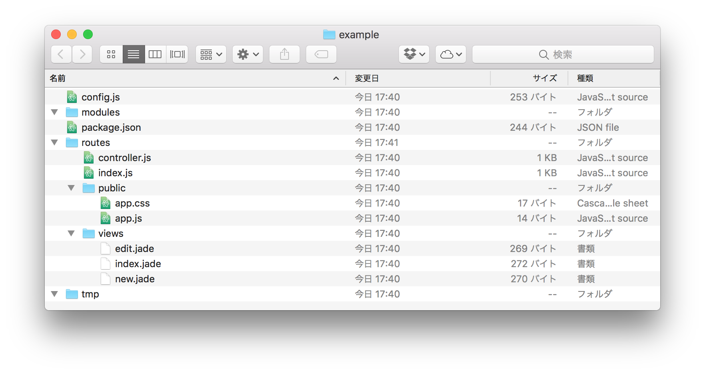

# Airlane

Airlane is the fast development environments with express. From micro service to more big services.

## Features

- Routing
- Database with O/R mapper ([Sequelize](http://docs.sequelizejs.com/en/v3/))
  - Support PostgreSQL/MySQL/SQLite3/MS SQL
- Each routing has own View, Routing and Controller
- Session
- Code generator
- Support ES2015
  - Server side
  - Web Browser
- Development server
  - Chrome inspector
  - Auto reload
  - Auto re-deploy
- Watchify
  - Client side JavaScript
  - Client side Stylesheet

## Install

```
npm install airlane -g
```

## Usage

```
cd some/path
airlane init app # Your application name
cd app
airlane serve
```

Open http://localhost:8080/

## Constructors

Airlane generates those files.



- config.js is development configures.
- module contains database model, libraries.
- routes contains controller, router, javascript, stylesheets, and views.
- tmp is for temporary files like session database.

Default router supports below. It's simple RESTful.

- GET /
- GET /new
- GET /:id/edit
- POST /
- PUT /:id
- DELETE /:id

## Add new routes.

When you add new routes like /users, you should enter command below.

```
$ airlane generate route users
```

Airlane generates those files.

```
$ tree .
.
├── routes
│   ├── users
│   │   ├── controller.js
│   │   ├── index.js
│   │   ├── public
│   │   │   ├── app.css
│   │   │   └── app.js
│   │   └── views
│   │       ├── edit.jade
│   │       ├── index.jade
│   │       └── new.jade
```


Each route has own View, Routing and Controller inside routes directory. After generating, you have those routes.

- GET /users
- GET /users/new
- GET /users/:id/edit
- POST /users
- PUT /users/:id
- DELETE /users/:id

## Modules

Airlane has no module generator yet. You can make files like this.

```
modules/
└── db
    ├── index.js
    └── user.js
```

Airlane read every modules under modules directory. Each module has sub directory like db and there is index.js. Airlane import index.js.

**index.js**

```
let fs = require('fs');
let target_dir = fs.realpathSync('./');

module.exports = (options) => {
  let models = {};
  fs.readdir(`${target_dir}/modules/db`, (error, files) => {
    files.forEach((file, i) => {
      if (file.match(/^\./)) {
        return;
      }
      if (file === 'index.js')
        return;
      if (!file.match(/.*\.js$/))
        return;
      file = file.replace(/\.js$/g, "");
      models[file.capitalize()] = require(`./${file}`)(options)
    })
  });
  return models;
}
```

**user.js:**

```
// var sequelize = require('../../libs/database');
var crypto = require("crypto");

module.exports = (options) => {
  var database = options.database;
  var Sequelize = database.Sequelize;
  var db = database.database;

  var User = db.define('users', {
    id: {
      type: Sequelize.INTEGER,
      autoIncrement: true,
      primaryKey: true
    },
    name: {
      type: Sequelize.STRING
    },
    :
  }, {
    freezeTableName: true
  });

  User.role = 'User';
  return User;
}
```

Airlane supports Sequelize for O/R mapping. And you can use modules in router like this.

```
router.get('/new', (req, res, next) => {
  console.log(req.app.airlane.modules); // All modules
  console.log(req.app.airlane.modules.find('User')); // Get user module. You decide it with module's role like User.role = 'User';
  controller.new(req, res, next);
});
```

## TODO

- [ ] Generate module
- [ ] Sample code
- [ ] Test system

## LICENSE

MIT License
